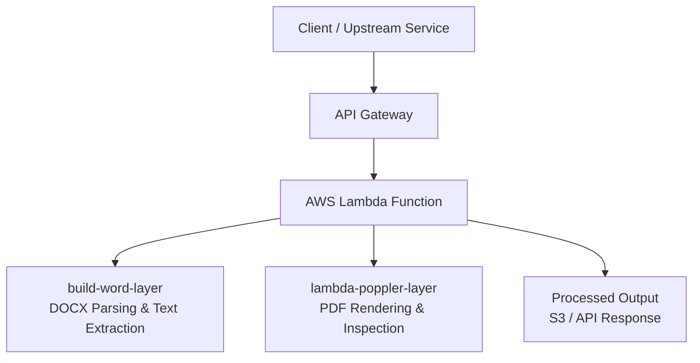

# AWS Lambda Layers for Document Processing

This repository contains **production-ready AWS Lambda Layers** designed for **document processing and conversion workflows** in serverless environments.

All layers are built using **Docker-based, reproducible build pipelines** to ensure compatibility with the **AWS Lambda Linux runtime** and to enable reuse across multiple Lambda functions.

---

## Architecture Overview

### Diagram Explanation

The diagram illustrates a **serverless document processing pipeline** where **native Linux dependencies** are isolated into reusable **AWS Lambda Layers**.

- Client requests are handled through **API Gateway**
- A single Lambda function consumes multiple layers depending on document type
- Document-specific tooling is decoupled from application logic
- Processed outputs are returned via API or stored in **Amazon S3**

This design improves **reusability, security, and deployment simplicity**, while remaining within AWS Lambda runtime constraints.

---

## Included Layers

### 📦 build-word-layer

A Lambda Layer providing **Microsoft Word (.docx) document processing capabilities** for AWS Lambda.

**Purpose**
- Parse Word documents and extract structured text
- Enable document preprocessing in serverless workflows

**Key Features**
- Docker-built binaries for Lambda compatibility
- Minimal runtime footprint
- Clean separation between native dependencies and Lambda code

**Typical Use Cases**
- CV / résumé parsing
- Document validation pipelines
- Text extraction prior to NLP or AI processing

---

### 📦 lambda-poppler-layer

A Lambda Layer packaging **Poppler utilities** for PDF processing inside AWS Lambda.

**Purpose**
- Enable PDF inspection and high-quality rendering in serverless environments

**Key Features**
- Includes Poppler tools such as `pdftoppm` and `pdfinfo`
- Compiled specifically for the Lambda execution environment
- Optimised to reduce cold-start overhead

**Typical Use Cases**
- PDF to image conversion
- OCR preprocessing pipelines
- Secure document preview generation

---

## Why This Repository Matters

This project demonstrates practical experience with:

- AWS Lambda internals and runtime limitations
- Docker-based Linux binary compilation
- Infrastructure modularisation using Lambda Layers
- Serverless document processing at scale
- Production-ready cloud architecture design

The layers were designed with **real-world constraints** in mind, including:

- Lambda package size limits
- Cold start performance
- Reusability across multiple services
- CI/CD-friendly build pipelines

---

## Skills Highlighted

- AWS Lambda & Lambda Layers  
- Docker & Linux build environments  
- Serverless architecture design  
- Document processing workflows  
- Cloud-native infrastructure modularisation  

---

## Notes

If Mermaid diagrams are not rendered in your environment, the architecture is:

Client → API Gateway → Lambda  
Lambda → build-word-layer / lambda-poppler-layer  
Output → S3 or API response

---

## License

MIT License
